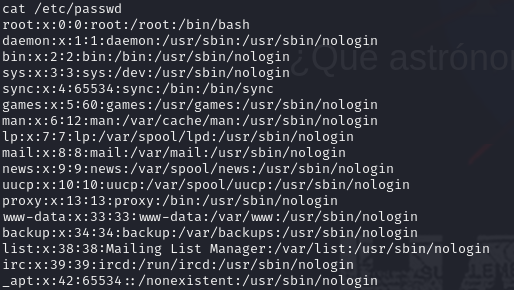

Empezamos con la maquina Stellarkwdt

Arrancamos con un escaneo de puertos con nmap

Lo que podemos observar es que tenemos abiertos los puertos *22* y *80* corriendo *ssh* y *http* respectivamente 

Nos dirigimos al navegador para ver que contiene este *http*

El nombre *Johann Gottfried Galle* (Info de Google) y *Neptuno* podrian servirnos para mas adelante 

Seguimos con  fuzzing para descubrir directorios y encontramos */universe/*
 

Nada a la vista por lo que investigamos el codigo fuente

Encontramos esto en el codigo fuente, investigamos descubrimos que es un json que nos dice que el usuario es *neptuno*

Vamos a probar hacer un ataque de fuerza bruta al ssh, con un archivo pass.txt con los posibles passwords:

    johann
    gottfried
    galle
    Johann
    Gottfried
    Galle
    johanngottfriedgalle
    JohannGottFriedGalle

Bingo! La passwd es *Gottfried* 

Acedemos por *ssh* con el usuario *neptuno* y la passwd *Gottfried*

Encontarmos el archivo *.carta_a_la_NASA.txt*, por lo que procedemos a ver que contiene 

Podemos ver que es una carta a la NASA con alguna informacion, podemos tomar *Eisenhower* que quiza nos pueda servir para mas adelante como contraseña quiza de algo 

    ls /home

Vaya! Aqui tenemos dos usuarios a los que podemos intentar acceder

Intentamos loguearnos a *nasa* con la passwd *Eisenhower* y lo conseguimos!

Seguimos investigando 

    ls -la

Para listar todos los archivos y no encontramos nada de reelevancia

    sudo -l

Para listar los permisos 

Y nos muestra algo muy interesante, el usr *elite* puede ejecutar *socat* sin passw

Por lo que buscamos en *gtfobins* para ver como podemos aprovechar este binario y nos da lo siguiente

Conseguimos este comando para crear una shell como *elite*

Ahora somos *elite*!

    sudo -l

Para listar permisos 

Y nuevaente tenemos otro dato muy interesante, root puede ejecutar chown sin la passwd, lo que nos dice que podemos cambiar de propiedad archivos con root sin contraseñas

Cambiamos la propiedad del archivo */ect/passwd* 

*cat* para ver que contiene

Aqui en este momento tenemos acceso a el archivo */etc/passwd*, y al tener los privilegios tambien podemos modificarlo

Por lo que si quitamos la *x* al usuario *root*, lo dejariamos sin contraseña y tendriamos el control completo de la maquina... A por ello!

    su root

Y lo conseguimos!! Ya somos *root*